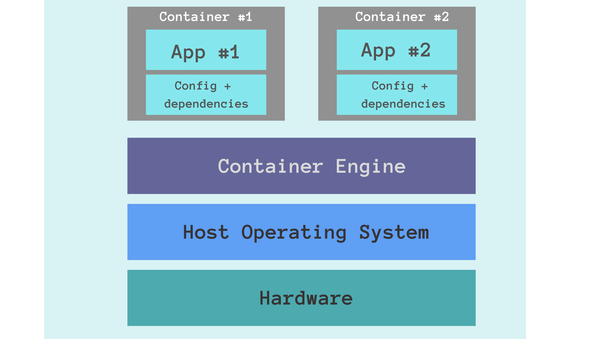
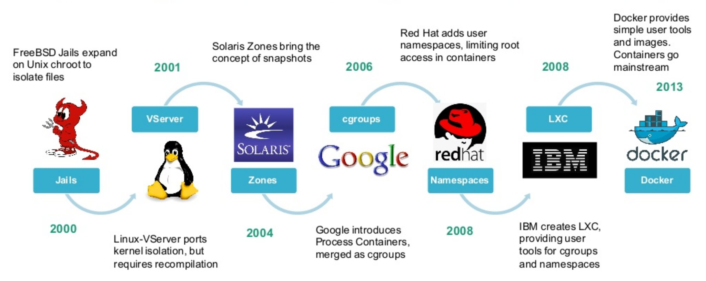
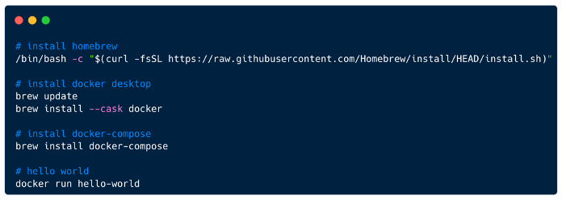
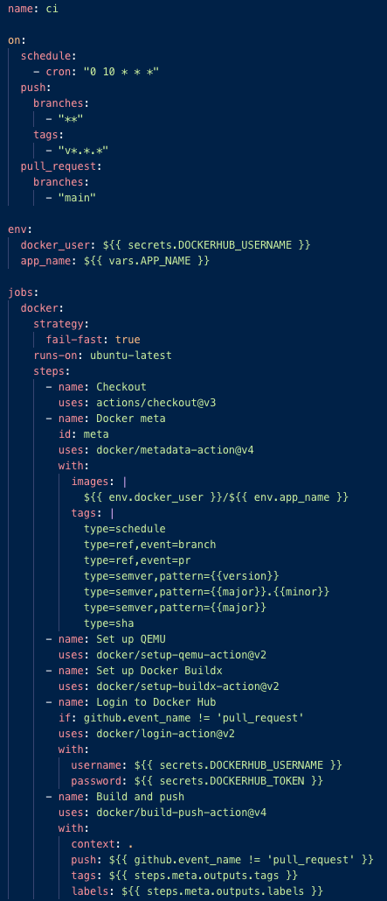

# Intro to Docker

<!--  -->
<!--  -->


---

## Intro

**Lance Stephens**

Been in the game for over a decade. Was a DevOps engineer at Greenhouse Software until May 2023 (3.5 years). 

Now [#opentowork](https://www.linkedin.com/in/lancestephens/)!

Extracurriculars include community organizing with [Pythonistas](https://www.meetup.com/pythonistas/) (founder) and [Coffee & Code](https://www.meetup.com/okccoffeeandcode/), volunteering with [ReMerge](https://www.remergeok.org/), going to concerts, and travel.

<!--  -->


---

## Topics

**Covered**

* Brief explanation and history
* Setup environment
* Dockerfile
* Docker Compose
* Upload to Docker Hub registry
* Continuous Integration

<!--  -->


---

## Topics

**Out of Scope**

* Alternatives (Podman, Kaniko, OrbStack)
* Architectures (x86, ARM)
* Buildkit
* Kubernetes (k8s)
* Cloud providers (e.g., AWS, Azure, GCP)

<!--  -->


---

## Brief Explanation of Containers 

### Virtual Machines vs. Containers
<!--  -->
<!--  -->
| virtual machines | containers |
|:---:|:---:|
|||

[Docker vs Virtual Machine (VM) – Key Differences You Should Know](https://www.freecodecamp.org/news/docker-vs-vm-key-differences-you-should-know/)

---

## Brief History of Containers 

<!--  -->


[Containerization History - Docker Handbook](https://borosan.gitbook.io/docker-handbook/containerization-history)

---

## Repo

<!-- <span style="color: white;">https://github.com/pythoninthegrass/docker_101)</span> -->
[https://github.com/pythoninthegrass/docker_101](https://github.com/pythoninthegrass/docker_101)

<!--  -->
<!--  -->


<br/>

---

## Setup

Instructions for macOS below ([Windows](https://docs.docker.com/desktop/install/windows-install/), [Linux](https://docs.docker.com/desktop/install/linux-install/#generic-installation-steps))

<!--  -->


---

## `Dockerfile` vs. `docker-compose.yml`

### `Dockerfile`
```docker
FROM awesome/webapp
COPY . /usr/src/app
CMD ["python", "app.py"]
```

### `docker-compose.yml`
```yaml
services:
  frontend:
    image: awesome/webapp
    ports:
      - "443:8043"
    networks:
      - front-tier
      - back-tier
    configs:
      - httpd-config
    secrets:
      - server-certificate

  backend:
    image: awesome/database
    volumes:
      - db-data:/etc/data
    networks:
      - back-tier

volumes:
  db-data:
    driver: flocker
    driver_opts:
      size: "10GiB"

configs:
  httpd-config:
    external: true

secrets:
  server-certificate:
    external: true

networks:
  # The presence of these objects is sufficient to define them
  front-tier: {}
  back-tier: {}
```

---

## `Dockerfile` vs. `docker-compose.yml`
### `Dockerfile`
* Domain Specific Language (DSL)
* Builds an image
* Interpreted

### `docker-compose.yml`
* Yet Another Markup Language (YAML)
* Definines services, networks, and volumes for a Docker application
  * Can build local image from `Dockerfile` or use remote image on a container registry
* Runtime based on element level and global directives

---

## Dockerfile
### Common Directives

- FROM
- ARG
- ENV
- RUN
- WORKDIR
- COPY
- EXPOSE
- ENTRYPOINT
- CMD

```dockerfile
FROM python:3.11-slim-bullseye

# avoid stuck build due to user prompt
ARG DEBIAN_FRONTEND=noninteractive

# install dependencies
RUN apt -qq update && apt -qq install curl gcc lsof python3-dev
RUN rm -rf /var/lib/apt/lists/*

# pip env vars
ENV PIP_DISABLE_PIP_VERSION_CHECK=on
ENV PIP_DEFAULT_TIMEOUT=100

# poetry env vars
ENV POETRY_HOME="/opt/poetry"
ENV POETRY_VERSION=1.4.2
ENV POETRY_VIRTUALENVS_IN_PROJECT=true
ENV POETRY_NO_INTERACTION=1

# path
ENV VENV="/opt/venv"
ENV PATH="$POETRY_HOME/bin:$VENV/bin:$PATH"

# working directory (creates dir if it doesn't exist)
RUN mkdir -p /app
WORKDIR /app

# copy all files from current dir to working dir
COPY . .

# install poetry and dependencies
RUN python -m venv $VENV && . "${VENV}/bin/activate"
RUN python -m pip install "poetry==${POETRY_VERSION}"
RUN poetry install --no-ansi --no-root --without dev

# listening port (not published)
EXPOSE 3000

ENTRYPOINT ["python", "main.py"]
# CMD ["default", "arg"]
```
<!--  -->

---

## Dockerfile
### Common Directives

[`FROM`](https://docs.docker.com/engine/reference/builder/#from)
> The `FROM` instruction initializes a new build stage and sets the *Base Image* for subsequent instructions. 
> 
> As such, a valid `Dockerfile` must start with a `FROM` instruction.

---

## Dockerfile
### Common Directives

[`ARG`](https://docs.docker.com/engine/reference/builder/#arg)
> The `ARG` instruction defines a variable that users can pass at build-time to the builder...
>
> A `Dockerfile` may include one or more `ARG` instructions.

---

## Dockerfile
### Common Directives

[`ENV`](https://docs.docker.com/engine/reference/builder/#env)
> The `ENV` instruction sets the environment variable `<key>` to the value `<value>`. This value will be in the environment for all subsequent instructions in the build stage and can be replaced inline in many as well.

---

## Dockerfile
### Common Directives

[`RUN`](https://docs.docker.com/engine/reference/builder/#run)
> The `RUN` instruction will execute any commands in a new layer on top of the current image and commit the results.<br/>
> The resulting committed image will be used for the next step in the `Dockerfile`.

---

## Dockerfile
### Common Directives

[`WORKDIR`](https://docs.docker.com/engine/reference/builder/#workdir)
> The `WORKDIR` instruction sets the working directory for any `RUN`, `CMD`, `ENTRYPOINT`, `COPY` and `ADD` instructions that follow it in the `Dockerfile`.

---

## Dockerfile
### Common Directives

[`COPY`](https://docs.docker.com/engine/reference/builder/#copy)
> The `COPY` instruction copies new files or directories from `<src>` and adds them to the filesystem of the container at the path <dest>.

```dockerfile
COPY [--chown=<user>:<group>] [--chmod=<perms>] ["<src>",... "<dest>"]
```

---

## Dockerfile
### Common Directives

[`EXPOSE`](https://docs.docker.com/engine/reference/builder/#expose)
> The `EXPOSE` instruction informs Docker that the container listens on the specified network ports at runtime... [T]he default is TCP if the protocol is not specified.
> 
> The `EXPOSE` instruction does not actually publish the port. It [documents] which ports are intended to be published. 

---

## Dockerfile
### Common Directives

[`ENTRYPOINT`](https://docs.docker.com/engine/reference/builder/#entrypoint)

`ENTRYPOINT` has two forms:
The exec form, which is the preferred form:
`ENTRYPOINT ["executable", "param1", "param2"]`

The shell form:
`ENTRYPOINT command param1 param2`

---

## Dockerfile
### Common Directives

[`CMD`](https://docs.docker.com/engine/reference/builder/#cmd)
> The main purpose of a `CMD` is to provide defaults for an executing container.<br/>
> There can only be one CMD instruction in a Dockerfile.<br/>
> If you list more than one CMD then only the last CMD will take effect.<br/>

---

## Dockerfile
### Common Directives

[`CMD`](https://docs.docker.com/engine/reference/builder/#cmd)

The `CMD` instruction has three forms:
- `CMD` ["executable", "param1", "param2"] 
  - exec form, this is the _preferred_ form
- `CMD` ["param1", "param2"] 
  - as default parameters to `ENTRYPOINT`
- `CMD` command param1 param2 (shell form)

---

## Dockerfile
### Common Directives

[`VOLUME`](https://docs.docker.com/engine/reference/builder/#volume)

The `VOLUME` instruction creates a mount point with the specified name and marks it as holding externally mounted volumes from native host or other containers.

---

## Dockerfile
### Common Directives

[`VOLUME`](https://docs.docker.com/engine/reference/builder/#volume)

Wait. 

---

## Dockerfile
### Common Directives

[`VOLUME`](https://docs.docker.com/engine/reference/builder/#volume)

Where __**is**__ `VOLUME`??

---

## Dockerfile
### Common Directives

[`VOLUME`](https://docs.docker.com/engine/reference/builder/#volume)

You __could__ do this:

```dockerfile
FROM ubuntu
RUN mkdir /myvol
RUN echo "hello world" > /myvol/greeting
VOLUME /myvol
```

---

## Dockerfile
### Common Directives

[`VOLUME`](https://docs.docker.com/engine/reference/builder/#volume)

But then...
> __The host directory is declared at container run-time__: The host directory (the mountpoint) is, by its nature, host-dependent.
<br/>
> This is to preserve image portability, since a given host directory can’t be guaranteed to be available on all hosts.<br/>
> For this reason, you can’t mount a host directory from within the `Dockerfile`. The `VOLUME` instruction does not support specifying a `host-dir` parameter.<br/>
> You must specify the mountpoint when you create or run the container.

---

## Dockerfile
### Common Directives

__Ergo__, declaring a `VOLUME` in a `Dockerfile` is __useless__*.
<br/>
<br/>
<br/>
<br/>
<br/>
<br/>
<br/>
* Except as documentation (cf. `EXPOSE`)

---

## Docker Commands

```bash
# show running containers
docker ps

# show images
docker images

# build docker image and tag
docker build -t helloworld .

# run image with interactive tty and remove container after
docker run -it --rm helloworld

# run image with volume mount and map port
docker run -it --rm -v $(pwd):/app -p 3000:3000 helloworld

# run image in background (detached) with shortened name 'hello'
docker run -it -d -name hello helloworld
```

---
<!-- TODO: embedded jupyter notebook? -->

## Demo Time
### Dockerfile

<!-- https://rew-online.com/demolition-one-of-the-last-ways-to-deregulate-a-building/ -->

---

## Docker Compose (file)
### Bird's Eye View

```yaml
version: "3.9"

services:
  helloworld:
    container_name: hello-world
    platform: linux/amd64         # linux/amd64 / linux/arm64/v8
    image: hello-world
    tty: false                    # false for `entrypoint` in Dockerfile
    stdin_open: false             # false for `entrypoint` in Dockerfile
    env_file:
      - ./.env
    environment:
      - PIP_DISABLE_PIP_VERSION_CHECK=off
    volumes:
      - .:/app
    ports:
      - 3000:3000/tcp
    build:
      context: ./
      dockerfile: ./Dockerfile.web

networks:
  default:
    driver: bridge                # bridge / host / none
```

---

<!-- PRESENTER -->
^ ### services - tty
* tty: default is true; allocates pseudo-TTY (`docker exec -t`)
  * teleprinters -> teletypes (TTY)
  * In Linux, there is a pseudo-teletype multiplexor which handles the connections from all of the terminal window pseudo-teletypes (PTS)

---

<!-- PRESENTER -->
^ ### services - stdin_open
* stdin_open: default is true; keep STDIN open even if not attached (`docker exec -i`)
  * STDIN: standard input
  * STDOUT: standard output
  * STDERR: standard error

---

## Docker Compose (file)
### networks

<!-- PRESENTER -->
^ ### network drivers
* bridge: private network internal to host so containers on this network can communicate via exposed ports
* host: networking provided by the host machine
* none: disable all networking

---

## Docker Compose (commands)

```bash
# clean build (remove --no-cache for speed,
docker-compose build --no-cache --parallel

# start container
docker-compose up --remove-orphans -d

# exec into container
docker exec -it hello-world bash

# stop container
docker-compose stop

# destroy container and network
docker-compose down
```

---

## Demo Time
### Docker Compose

<!-- TODO: embedded jupyter notebook? -->

<!-- https://rew-online.com/demolition-one-of-the-last-ways-to-deregulate-a-building/ -->

---

## Push Docker Image to Docker Hub
### Manually

```bash
# login to docker hub
docker login

# tag image
docker tag hello:latest <dockerhub_username>/hello:latest

# push image
docker push <dockerhub_username>/hello:latest
```

---

## Push Docker Image to Docker Hub
### Automatically with GitHub Actions (CI)

Setup Actions secrets and variables
* `DOCKERHUB_USERNAME`
* `DOCKERHUB_TOKEN`

<!--  -->
<!--  -->


---

## Push Docker Image to Docker Hub
### Automatically with GitHub Actions (CI)

```yaml
name: ci

on:
  schedule:
    - cron: "0 10 * * *"
  push:
    branches:
      - "**"
    tags:
      - "v*.*.*"
  pull_request:
    branches:
      - "main"

env:
  docker_user: ${{ secrets.DOCKERHUB_USERNAME }}
  app_name: ${{ vars.APP_NAME }}

jobs:
  docker:
    strategy:
      fail-fast: true
    runs-on: ubuntu-latest
    steps:
      - name: Checkout
        uses: actions/checkout@v3
      - name: Docker meta
        id: meta
        uses: docker/metadata-action@v4
        with:
          images: |
            ${{ env.docker_user }}/${{ env.app_name }}
          tags: |
            type=schedule
            type=ref,event=branch
            type=ref,event=pr
            type=semver,pattern={{version}}
            type=semver,pattern={{major}}.{{minor}}
            type=semver,pattern={{major}}
            type=sha
      - name: Set up QEMU
        uses: docker/setup-qemu-action@v2
      - name: Set up Docker Buildx
        uses: docker/setup-buildx-action@v2
      - name: Login to Docker Hub
        if: github.event_name != 'pull_request'
        uses: docker/login-action@v2
        with:
          username: ${{ secrets.DOCKERHUB_USERNAME }}
          password: ${{ secrets.DOCKERHUB_TOKEN }}
      - name: Build and push
        uses: docker/build-push-action@v4
        with:
          context: .
          push: ${{ github.event_name != 'pull_request' }}
          tags: ${{ steps.meta.outputs.tags }}
          labels: ${{ steps.meta.outputs.labels }}
```

<!--  -->
<!--  -->

---

## Push Docker Image to Docker Hub
### Automatically with GitHub Actions (CI)

```yaml
name: ci

on:
  schedule:
    - cron: "0 10 * * *"
  push:
    branches:
      - "**"
    tags:
      - "v*.*.*"
  pull_request:
    branches:
      - "main"

env:
  docker_user: ${{ secrets.DOCKERHUB_USERNAME }}
  app_name: ${{ vars.APP_NAME }}
  
...
```

---

## Push Docker Image to Docker Hub
### Automatically with GitHub Actions (CI)

```yaml
jobs:
  docker:
    strategy:
      fail-fast: true
    runs-on: ubuntu-latest
    steps:
      - name: Checkout
        uses: actions/checkout@v3
      - name: Docker meta
        id: meta
        uses: docker/metadata-action@v4
        with:
          images: |
            ${{ env.docker_user }}/${{ env.app_name }}
          tags: |
            type=schedule
            type=ref,event=branch
            type=ref,event=pr
            type=semver,pattern={{version}}
            type=semver,pattern={{major}}.{{minor}}
            type=semver,pattern={{major}}
            type=sha

        ...
```

---

## Push Docker Image to Docker Hub
### Automatically with GitHub Actions (CI)

```yaml
    - name: Set up QEMU
        uses: docker/setup-qemu-action@v2
    - name: Set up Docker Buildx
        uses: docker/setup-buildx-action@v2
    - name: Login to Docker Hub
    if: github.event_name != 'pull_request'
    uses: docker/login-action@v2
    with:
        username: ${{ secrets.DOCKERHUB_USERNAME }}
        password: ${{ secrets.DOCKERHUB_TOKEN }}
    - name: Build and push
        uses: docker/build-push-action@v4
        with:
        context: .
        push: ${{ github.event_name != 'pull_request' }}
        tags: ${{ steps.meta.outputs.tags }}
        labels: ${{ steps.meta.outputs.labels }}
```

---

# Thank You!

* [Hartwig Staffing](https://hartwigstaffing.com/)
* [OKC Coffee & Code](https://www.meetup.com/okccoffeeandcode/)
* [Techlahoma](https://www.techlahoma.org/)
* [Gabe Cook](https://github.com/gabe565) @gabe565
  * For salvaging the [legendary `telnet` ASCII video](https://github.com/gabe565/ascii-movie) and leveling it up

---

## Repo (One Last Time)

[https://github.com/pythoninthegrass/docker_101](https://github.com/pythoninthegrass/docker_101)

<!--  -->


<br/>

---

# Also...

---

# [May the 4th Be With You](https://github.com/gabe565/ascii-movie)

<!--  -->


<br/>

```
docker run --rm -it ghcr.io/gabe565/ascii-movie play
```
